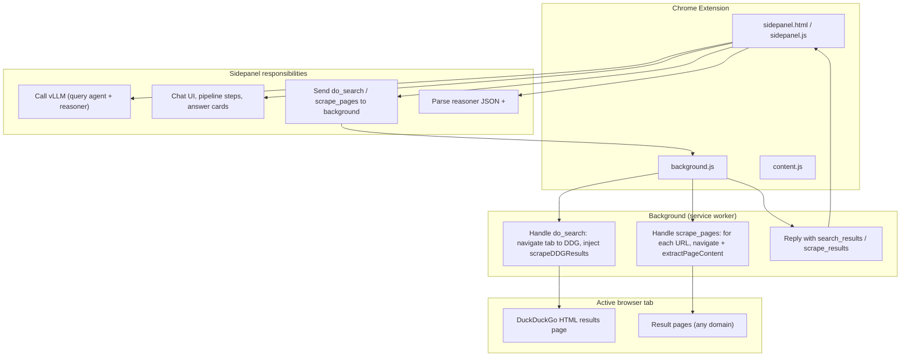
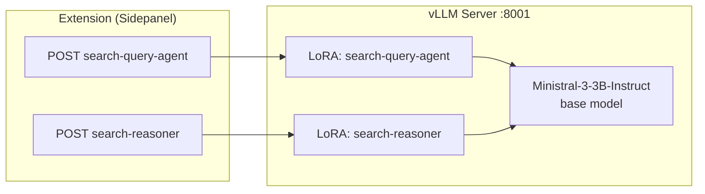
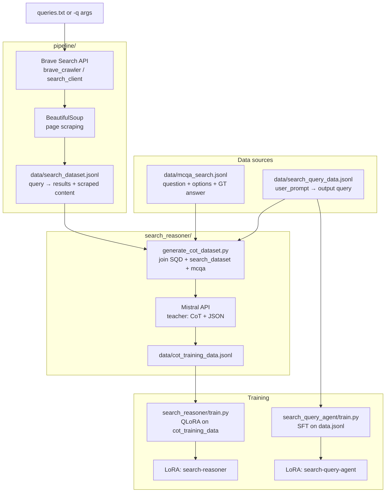
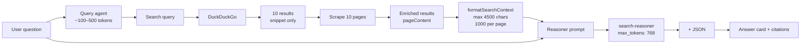
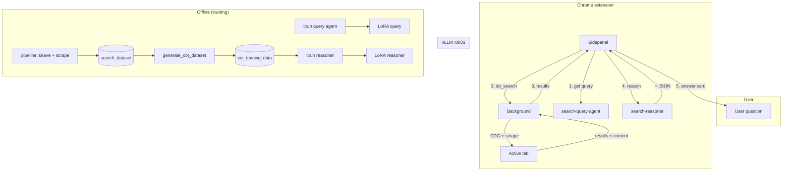

# Deepscout — Architecture Diagram

This document describes the full architecture of the Deepscout deep-research agent: runtime flow, training pipelines, data flow, and component responsibilities.

---

## 1. High-level system overview

```
┌─────────────────────────────────────────────────────────────────────────────────────────┐
│                                    DEEPSCOUT SYSTEM                                     │
├─────────────────────────────────────────────────────────────────────────────────────────┤
│                                                                                         │
│   ┌──────────────┐     ┌─────────────────────────────────────────────────────────────┐  │
│   │   USER       │     │                    CHROME EXTENSION                         │  │
│   │   (browser)  │◄───►│  Side Panel UI  ◄──►  Background  ◄──►  Active Tab (DDG)    │  │
│   └──────┬───────┘     └───────────────────────────┬─────────────────────────────────┘  │
│          │                                          │                                   │
│          │ question                                 │ search query                      │
│          │                                          │ results + scraped content         │
│          ▼                                          ▼                                   │
│   ┌──────────────────────────────────────────────────────────────────────────────────┐  │
│   │                         vLLM SERVER (localhost:8001)                             │  │
│   │   Base: Ministral-3-3B-Instruct  │  LoRA: search-query-agent  │  LoRA: search-reasoner │   │
│   └──────────────────────────────────────────────────────────────────────────────────┘   │
│                                                                                           │
│   OFFLINE:  pipeline/ (Brave + scrape) → data/  →  search_reasoner/generate_cot  →  train │
│                                                                                           │
└─────────────────────────────────────────────────────────────────────────────────────────┘
```

---

## 2. Runtime flow (user question → cited answer)

End-to-end flow when a user asks a question in the Chrome side panel.

```mermaid
sequenceDiagram
    participant User
    participant Sidepanel
    participant vLLM
    participant Background
    participant Tab

    User->>Sidepanel: Type question, Send
    Sidepanel->>Sidepanel: isMCQA(question)?
    Sidepanel->>vLLM: POST /v1/chat/completions (model: search-query-agent)
    Note over vLLM: Generate 5–12 word search query from question
    vLLM-->>Sidepanel: { content: "query" }
    Sidepanel->>Sidepanel: cleanQuery(raw)

    Sidepanel->>Background: chrome.runtime.sendMessage({ action: "do_search", query })
    Background->>Tab: Navigate to DuckDuckGo HTML (query)
    Tab-->>Background: Page loaded
    Background->>Tab: executeScript(scrapeDDGResults)
    Tab-->>Background: [ { title, url, snippet } ] × 10
    Background-->>Sidepanel: search_results (requestId)

    Sidepanel->>Background: sendMessage({ action: "scrape_pages", results })
    loop For each result (up to 10)
        Background->>Tab: Navigate to result.url
        Background->>Tab: executeScript(extractPageContent)
        Tab-->>Background: page text (max 2000 chars)
    end
    Background-->>Sidepanel: scrape_results (enriched results)

    Sidepanel->>Sidepanel: formatSearchContext(results) [max 4500 chars, 1000/page]
    Sidepanel->>vLLM: POST /v1/chat/completions (model: search-reasoner)
    Note over vLLM: System: reasoner prompt; User: question + search results
    vLLM-->>Sidepanel: <think>...</think> + JSON answer

    Sidepanel->>Sidepanel: parseReasonerResponse() → answer, confidence, evidence
    Sidepanel->>User: Answer card (confidence bar, citations, sources)
```

**Summary:**

| Step | Component | Action |
|------|-----------|--------|
| 1 | Sidepanel | User question → **search-query-agent** (vLLM) → single search query |
| 2 | Background + Tab | Navigate to DuckDuckGo HTML, inject `scrapeDDGResults` → 10 results (title, url, snippet) |
| 3 | Background + Tab | For each result URL: navigate, inject `extractPageContent` → enriched results with `pageContent` |
| 4 | Sidepanel | Build context string (question + results, truncate to 4500 chars) |
| 5 | Sidepanel | **search-reasoner** (vLLM) → <think> + JSON (answer, confidence, supporting_evidence) |
| 6 | Sidepanel | Parse response, render answer card + confidence bar + citations + clickable sources |

---

## 3. Chrome extension component diagram



**Files:**

| File | Role |
|------|------|
| `sidepanel.html` | Layout and containers for chat, steps, answer cards |
| `sidepanel.js` | CONFIG (vLLM URL, models), query agent + reasoner calls, search/scrape messaging, context formatting, response parsing, UI (messages, steps, confidence, citations, sources) |
| `background.js` | `do_search` → open DDG in tab, run `scrapeDDGResults`; `scrape_pages` → visit each URL, run `extractPageContent`; reply via `chrome.runtime.sendMessage` |
| `content.js` | Optional content-script hook (e.g. for future in-page UI) |

---

## 4. vLLM serving architecture



- **Single process:** one vLLM server, one base model, two LoRA modules.
- **search-query-agent:** system prompt (search query generator) + user question → short query string (cleaned in sidepanel).
- **search-reasoner:** system prompt (MCQ or freeform) + user message (question + search context) → <think> + JSON (answer, confidence, evidence, rankings).

---

## 5. Training and data pipeline (offline)

Used to build datasets and train the two LoRA adapters. No Chrome extension involved.



**Data flow summary:**

| Stage | Input | Output | Script / component |
|-------|--------|--------|---------------------|
| Search + scrape | Queries (file or CLI) | `data/search_dataset.jsonl` | `pipeline/search_scrape_pipeline.py` (Brave + BeautifulSoup) |
| Join + teacher | `search_query_data` + `search_dataset` + `mcqa_search` | `data/cot_training_data.jsonl` | `search_reasoner/generate_cot_dataset.py` (Mistral teacher) |
| Query agent SFT | `search_query_agent/data.jsonl` | LoRA adapter | `search_query_agent/train.py` |
| Reasoner SFT | `data/cot_training_data.jsonl` | LoRA adapter | `search_reasoner/train.py` |
| Eval | `mcqa_search` + `cot_training_data` | Reports, W&B | `search_reasoner/eval.py` |

---

## 6. Data formats and locations

```mermaid
flowchart LR
    subgraph data["data/"]
        MCQA_F[(mcqa_search.jsonl)]
        SQD_F[(search_query_data.jsonl)]
        SD_F[(search_dataset.jsonl)]
        COT_F[(cot_training_data.jsonl)]
    end

    subgraph search_query_agent["search_query_agent/"]
        D_JSONL[(data.jsonl)]
    end

    MCQA_F --> "generate_cot\n+ eval"
    SQD_F --> "generate_cot"
    SD_F --> "generate_cot"
    COT_F --> "train reasoner\n+ eval"
    D_JSONL --> "train query agent"
```

| File | Purpose | Typical keys |
|------|---------|----------------|
| `data/mcqa_search.jsonl` | Ground-truth MCQ answers | `responses_create_params.input`, expected answer |
| `data/search_query_data.jsonl` | Question → search query | `user_prompt`, `output` (query) |
| `data/search_dataset.jsonl` | Query → search + scrape | `id`, `query`, `search_results`, `scraped_pages` |
| `data/cot_training_data.jsonl` | CoT training for reasoner | question, search context, <think>, JSON answer |
| `search_query_agent/data.jsonl` | Query-agent SFT | system/user/assistant or equivalent for query generation |

---

## 7. End-to-end context and token flow (runtime)



- **Query agent:** question only; output is one short query.
- **Reasoner:** system prompt + user message (question + truncated search context). Context cap (e.g. 4500 chars, 1000 per page) avoids context-length errors.

---

## 8. Directory and responsibility map

```
deepscout-research-agent/
├── chrome-extension/          # Runtime: UI + search/scrape in browser
│   ├── sidepanel.js           # vLLM client, messaging, parsing, UI
│   ├── background.js          # do_search (DDG), scrape_pages (extractPageContent)
│   └── content.js
├── search_query_agent/        # Training: MCQ → search query
│   ├── train.py
│   ├── system_prompt.md
│   └── data.jsonl
├── search_reasoner/           # Training + eval: reason over search results
│   ├── train.py               # QLoRA on CoT data
│   ├── generate_cot_dataset.py # Join + Mistral teacher → CoT JSONL
│   └── eval.py                # Base vs fine-tuned eval
├── pipeline/                  # Offline: build search_dataset
│   ├── search_scrape_pipeline.py  # Brave + scrape → JSONL
│   ├── brave_crawler.py
│   └── search_client.py
├── data/                      # Datasets (see data/README.md)
└── docs/                      # This file, baseline_eval, etc.
```

---

## 9. Summary diagram (one-page view)



This gives the full picture: **runtime** (extension ↔ vLLM ↔ tab) and **offline** (pipeline → data → CoT generation → training → LoRA adapters).
